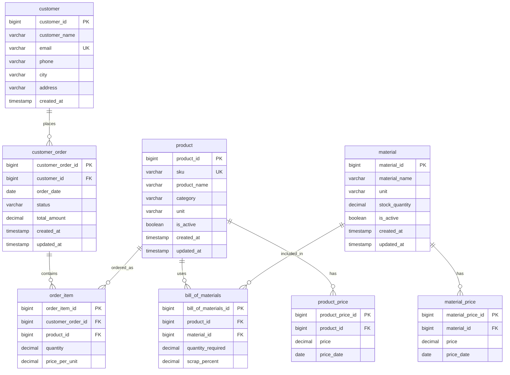

# ER-диаграмма ManufacturingDB

Связи:

- `product` 1:N `bill_of_materials`
- `material` 1:N `bill_of_materials`
- `product` 1:N `product_price`
- `material` 1:N `material_price`
- `customer` 1:N `customer_order`
- `customer_order` 1:N `order_item`
- `product` 1:N `order_item`
